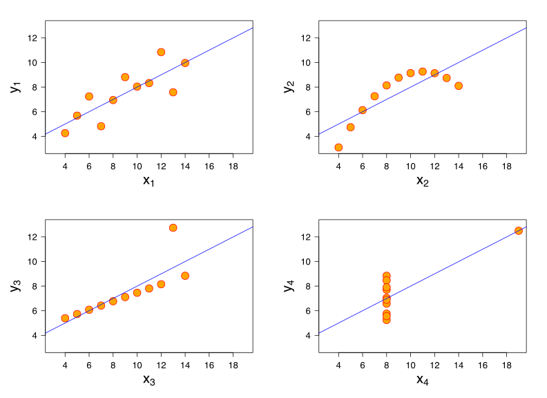
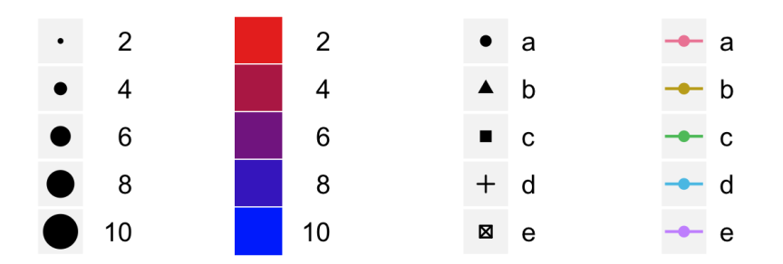

```{r setup, include=FALSE}
knitr::opts_chunk$set(echo = TRUE)
library(datasets)
library(tidyverse)
library(kableExtra)
library(psych)
```

## R and graphs

- simple to use but strong graphical system
- vector based - crisp, resizable, multiformat
- from simple charts to online interactive graphical dashboards

## Why is visualization important?

- famous Anscombe's Quartet
- 4 pairs of X-Y variabls
- Same mean(x), sd(x), mean(y), sd(y), cor(x,y)

## Why is visualization important?

```{r, warning=FALSE, message=FALSE, echo=FALSE}
mat<-describe(datasets::anscombe)
mat<- round(mat[,2:4],2)
kable(mat) %>%  kable_styling(bootstrap_options = c("striped", "hover", "condensed"), full_width = F)
```

## Why is visualization important?

```{r, echo=FALSE, fig.pos= "h", out.width = "100%"}

```

## Why is visualization important?

- summary statistics can decieve!
- Exploratory data analyses (Tukey, 1977):
    - "This is my favorite part about analytics: Taking boring flat data and bringing it to life through visualization."
    - "There is no data that can be displayed in a pie chart, that cannot be displayed better in some other type of chart."

## Grammar of graphics

- Wilkinson (1999)
    - framework which structures the process of describing and constructing visualizations or graphs
- Wickham (2010)
    - layered grammar of graphics - use layers to construct multidimensional graphs
    - "A grammar provides a strong foundation for understanding a diverse range of graphics"

## ggplot

- as grammar of graphics implementation
- graphs as objects
- combining layers one on top of the other
- saving intermediate steps and building branching graphs

## layered grammar of graphics

- data (raw data)
- layer
    - data & mapping (from data to aesthetics)
    - stat (statistical transformation; i.e. percentage or regression line)
    - geom (type of graph, geometrical representation)
    - position (position adjustment to prevent overlap)
- scale (controls the mapping of data to aes)
- coordinates (ticks, annotations, title etc.)
- facets (multiple graphs taht share the above by group members)

## data and mapping (data and aes)

- data independent of other aspects of graph (reusability)
- aes (aesthetics) - which variables are mapped to which aesthetic (x, y, color...)

## statistical transformation (stat)

- example: 
    - smooth (calculates the mean of y, conditional on x)
- stat takes a dataset as input and returns a dataset as output (stat can add new variables to the original dataset)

## geometric objects (geom)
- abstract component and can be rendered in different ways
- example: 
    - histogram
      - raw vs. summary (stat="identity")
    - point
      - jitter, alpha and size
    - density plot
      - alpha, coloring
    - boxplot
      - multiple variables with same scale
    - lineplot
      - width, color etc. 
  
## scale
- controls the mapping from data to aesthetic attributes
- scales are common across layers to ensure a consistent mapping from data to aesthetics

## scale

Wickham (2010)

```{r, echo=FALSE, fig.pos= "h", out.width = "100%"}

```

